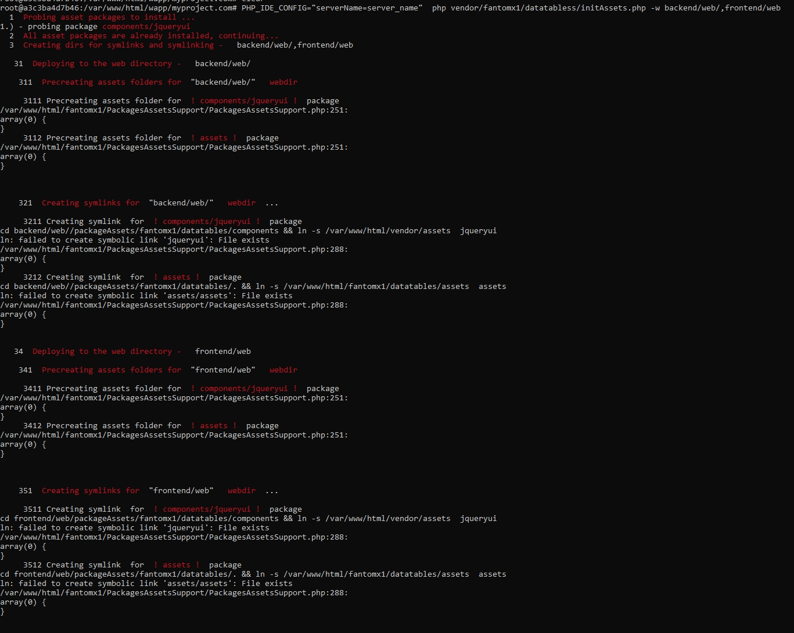

# packagesAssetsSupport
handles assets for generic(=non-framework specific) php packages


Sample usage, output:
Usage:
```
root@a3c3ba4d7b46:/var/www/html/myproject.com# PHP_IDE_CONFIG="serverName=server_name"  php vendor/fantomx1/datatabless/initAssets.php -w backend/web/,frontend/web
```
Output example:



Output:
```
root@a3c3ba4d7b46:/var/www/html/myproject.com# PHP_IDE_CONFIG="serverName=server_name"  php vendor/fantomx1/datatabless/initAssets.php -w backend/web/,frontend/web
  1  Probing asset packages to install ...
1.) - probing package components/jqueryui
  2  All asset packages are already installed, continuing...
  3  Creating dirs for symlinks and symlinking -   backend/web/,frontend/web

   31  Deploying to the web directory -   backend/web/

    311  Precreating assets folders for  "backend/web/"   webdir

     3111 Precreating assets folder for  ! components/jqueryui !  package
/var/www/html/fantomx1/PackagesAssetsSupport/PackagesAssetsSupport.php:251:
array(0) {
}
     3112 Precreating assets folder for  ! assets !  package
/var/www/html/fantomx1/PackagesAssetsSupport/PackagesAssetsSupport.php:251:
array(0) {
}


    321  Creating symlinks for  "backend/web/"   webdir  ...

     3211 Creating symlink  for  ! components/jqueryui !  package
cd backend/web//packageAssets/fantomx1/datatables/components && ln -s /var/www/html/vendor/assets  jqueryui
ln: failed to create symbolic link 'jqueryui': File exists
/var/www/html/fantomx1/PackagesAssetsSupport/PackagesAssetsSupport.php:288:
array(0) {
}
     3212 Creating symlink  for  ! assets !  package
cd backend/web//packageAssets/fantomx1/datatables/. && ln -s /var/www/html/fantomx1/datatables/assets  assets
ln: failed to create symbolic link 'assets/assets': File exists
/var/www/html/fantomx1/PackagesAssetsSupport/PackagesAssetsSupport.php:288:
array(0) {
}


   34  Deploying to the web directory -   frontend/web

    341  Precreating assets folders for  "frontend/web"   webdir

     3411 Precreating assets folder for  ! components/jqueryui !  package
/var/www/html/fantomx1/PackagesAssetsSupport/PackagesAssetsSupport.php:251:
array(0) {
}
     3412 Precreating assets folder for  ! assets !  package
/var/www/html/fantomx1/PackagesAssetsSupport/PackagesAssetsSupport.php:251:
array(0) {
}


    351  Creating symlinks for  "frontend/web"   webdir  ...

     3511 Creating symlink  for  ! components/jqueryui !  package
cd frontend/web/packageAssets/fantomx1/datatables/components && ln -s /var/www/html/vendor/assets  jqueryui
ln: failed to create symbolic link 'jqueryui': File exists
/var/www/html/fantomx1/PackagesAssetsSupport/PackagesAssetsSupport.php:288:
array(0) {
}
     3512 Creating symlink  for  ! assets !  package
cd frontend/web/packageAssets/fantomx1/datatables/. && ln -s /var/www/html/fantomx1/datatables/assets  assets
ln: failed to create symbolic link 'assets/assets': File exists
/var/www/html/fantomx1/PackagesAssetsSupport/PackagesAssetsSupport.php:288:
array(0) {
}
```

