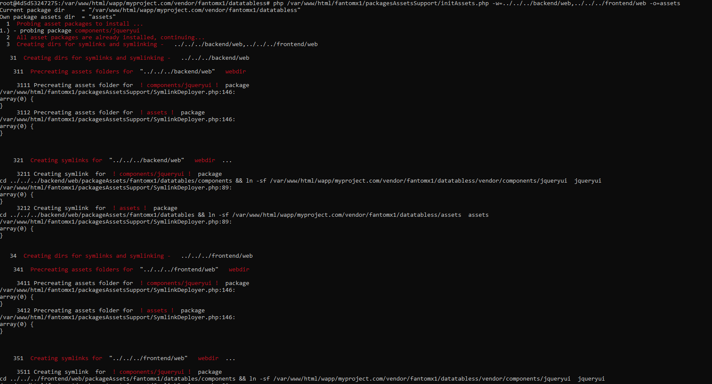

# packagesAssetsSupport
handles assets for generic(=non-framework specific) php packages

Takes care of distributing assets of packages and accessing them seamlessly in views specified in an own configuration file 'assetPackages.json' in a root directory,
leveraging composer on the background to prevent duplicity along sharing a unified installation approach for assets and packages in PHP  


## Sample usage of installing the assets (via the library command initAssets):

There are 2 approaches:

either 1) calling it **directly calling this original package command** or 2) **using own wrapping script inside own package** in your project .

#### 1) directly calling this original package command -
- this approach is more straightforward and simple, as the command is available from the shelf to be called from
any package from it's original location
```
root@4d5d53247275:/var/www/html/wapp/myproject.com/vendor/fantomx1/datatabless# 
php /var/www/html/fantomx1/packagesAssetsSupport/initAssets.php -w=../../../backend/web,../../../frontend/web -o=datatables/assets   
```
~~- where the "-p -package" - references relatively the curret package it is used in (toolmasterForeman)~~ -p is now automatic as a current working directory
- where the "-w -webdir" - comma separated references the directories where to distribute/publish assets using symlinks
- where the "-o --ownAssetsDir" - the directory of the package's own assets to  publish 

All the available command line parameters are listed inside [availableParams.php](availableParams.php) file.
   

#### 2) using own wrapping script inside own package
- this approach is maybe a little more concise and perhaps a little more transparent for the user and the package
owner gives impression that there is not executed a script from another library, however it needs a wrapper script workload
```
// fantomx1/datatables/initAssets.php
include "vendor/autoload.php";

$packageAssetsSupport = new \fantomx1\PackagesAssetsSupport();
// the 2nd voluntary parameter is the relative path of own assets to handle
$packageAssetsSupport->run(__DIR__, "assets");
```
then calling it from it's own directory -
```
/var/www/html/fantomx1/ToolMasterForeman# 
php vendor/fantomx1/packages-assets-support/initAssets.php  -w=examples/assets -o=./testAssets
```


#### Referencing the created assets directory via assets handlers in views

(
then using inside a packages view file/class for accessing the symlinked assets directory
```
<?php
$packageAssetsSupport = new \fantomx1\PackagesAssetsSupport();
$pathToAssets 
?>

<script type="text/javascript" src="<?php echo $assetsHandler->getAssetsDir("", "components/jqueryui/).'/js/jsfile.js'; ?>">
</script>

// for own library assets not passing the vendor assets library name

<script type="text/javascript" src="<?php echo $assetsHandler->getAssetsDir("", '').'/assets/js/jsfile.js'; ?>">
</script>
```

~~<script type="text/javascript" src="<?php echo $assetsHandler->getAssetsDir($rootDir, "components/jqueryui/).'/js/jsfile.js'; ?>">~~
~~where the $rootDir is the root dir of the our package in regard , it is being used in~~ - as of now v0.91 rootdir calculated automatically

)
## Output example:




